# SecondLife

SecondLife, c'est une appli mobile qui récompense le recyclage, avec un
peu d'IA dedans.

Le principe : tu prends un déchet en photo, l'appli reconnaît ce que
c'est et te dit combien de points ça peut rapporter. Ensuite tu vas le
déposer dans un point relais, un agent le pèse et valide ton dépôt. Avec
tes points, tu peux avoir des bons chez nos partenaires.

## Ce que fait l'appli

**Côté usager**
- Prendre un déchet en photo pour savoir ce que c'est (catégorie, poids
  estimé, points)
- Voir les points relais et les lieux de recyclage sur une carte, avec
  l'itinéraire
- Suivre ses dépôts (en attente ou traités) et ses bons
- Échanger ses points contre des récompenses
- Recevoir des notifications (dépôt validé ou refusé, nouveau bon)

**Côté agent (point relais)**
- Scanner le QR code de l'usager
- Peser le déchet, puis valider ou refuser le dépôt (avec une raison)
- Suivre le lot en cours et dire quand il a été récupéré
- Voir l'historique des validations

**Pour tout le monde** : thème clair/sombre, français/anglais, et une
police adaptée aux personnes dyslexiques.

## Aperçu

<p align="center">
  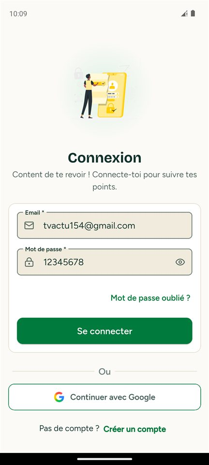
  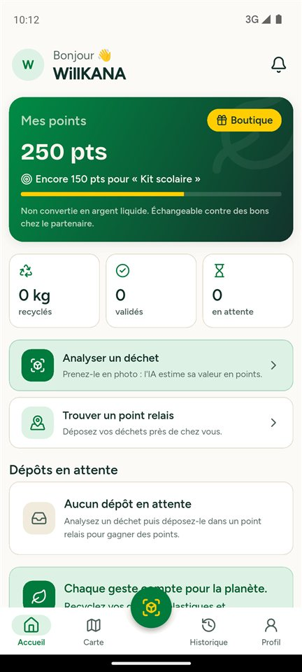
  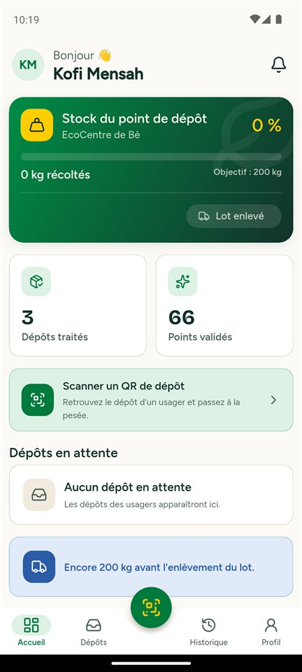
</p>

## Tester l'appli

On a surtout testé sur **Android** (iOS devrait marcher aussi). Le web et
la version PC ne sont pas configurés.

### Comptes de test

Il n'y a qu'une seule appli et un seul écran de connexion : l'appli voit
toute seule si tu es usager ou agent.

| Rôle | Email | Mot de passe | Point relais |
|------|-------|--------------|--------------|
| Usager | `tvactu154@gmail.com` | `12345678` | — |
| Agent | `agent.kofi@secondlife.test` | `Agent1234!` | EcoCentre de Bè (RP001) |
| Agent | `agent.ama@secondlife.test` | `Agent1234!` | Point Relais Tokoin (RP002) |
| Agent | `agent.sena@secondlife.test` | `Agent1234!` | Centre Recyclage Lacs (RP003) |

Tu peux aussi créer ton propre compte usager avec le bouton
« Créer un compte ».

### Lancer le projet

Ce qu'il faut avoir : Flutter (une version stable récente, Dart ≥ 3.13 ;
nous on a utilisé Flutter 3.47.5), le SDK Android, et un émulateur ou un
téléphone Android avec le débogage USB activé.

1. **Récupérer les fichiers de config.** Ils ne sont pas sur le repo,
   demande-les nous et mets-les ici :

   | Fichier | À quoi il sert |
   |---------|----------------|
   | `lib/firebase_options.dart` | Config Firebase (généré avec `flutterfire configure`) |
   | `android/app/google-services.json` | Config Firebase pour Android |
   | `lib/core/configs/secrets.dart` | Clé de l'API pour l'analyse IA (copie `secrets.example.dart`) |

2. **Installer les dépendances et générer le code** (pour Riverpod) :

   ```bash
   flutter pub get
   dart run build_runner build --delete-conflicting-outputs
   ```

3. **Lancer un émulateur puis l'appli** :

   ```bash
   flutter emulators                       # pour voir les émulateurs dispo
   flutter emulators --launch <nom>        # par exemple Pixel_7
   flutter run
   ```

   Si tu veux un APK à mettre sur ton téléphone :

   ```bash
   flutter build apk --release
   # → build/app/outputs/flutter-apk/app-release.apk
   ```

4. Te connecter avec un des comptes au-dessus.

> **Sur émulateur**, pense à accepter les permissions caméra et
> localisation. La caméra de l'émulateur montre une fausse scène, donc
> pour tester l'analyse d'un vrai déchet c'est mieux sur un vrai
> téléphone. Si la connexion charge sans fin, vérifie que l'émulateur a
> bien Internet.

### Comment tester un dépôt en entier

Il faut deux appareils (ou un téléphone + un émulateur) : un pour
l'usager, un pour l'agent.

1. **Usager** : *Analyser un déchet* → prendre la photo → l'IA donne la
   catégorie, le poids et les points → choisir un point relais. Un ticket
   avec un QR code s'affiche.
2. **Agent** (du point relais choisi) : bouton *Scanner* au milieu →
   scanner le QR de l'usager → entrer le vrai poids → valider ou refuser.
3. **Usager** : la notification arrive et les points sont ajoutés. Tu
   peux les échanger contre un bon dans la *Boutique*.
4. **Agent** : sur l'accueil, on voit le lot se remplir. Quand il est
   récupéré, on le déclare comme enlevé.

### Écrans usager

<p align="center">
  
  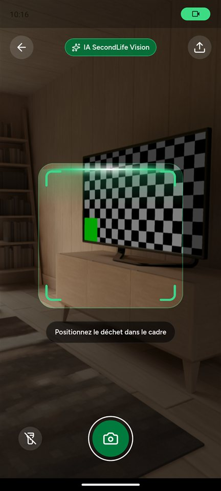
  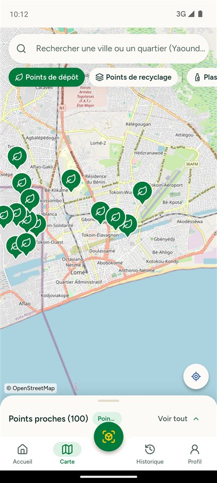
</p>
<p align="center">
  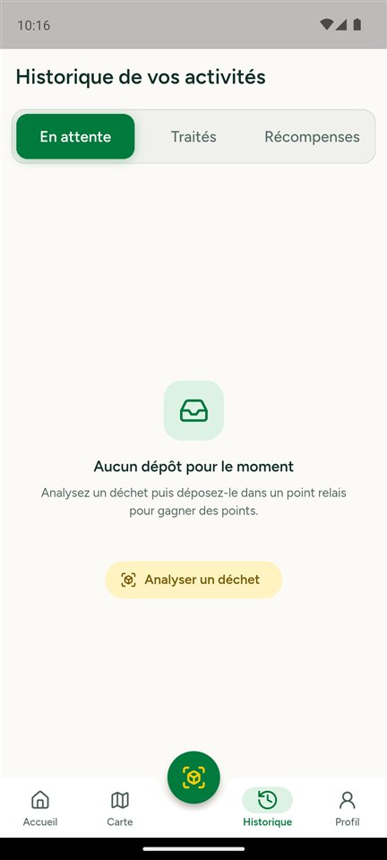
  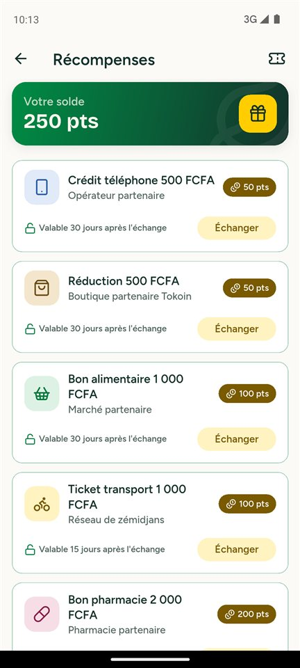
  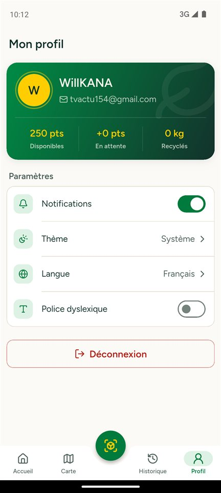
</p>

### Écrans agent

<p align="center">
  
  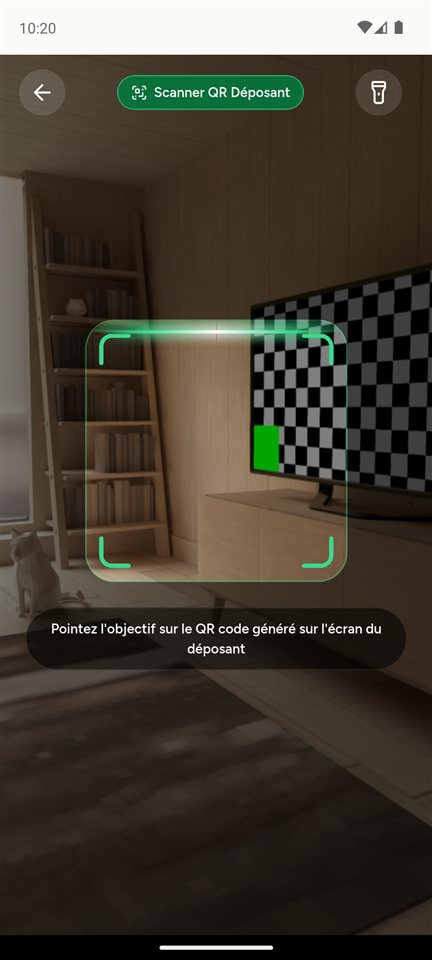
  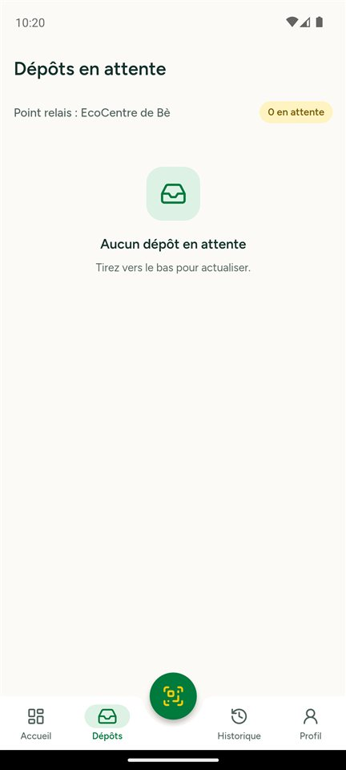
  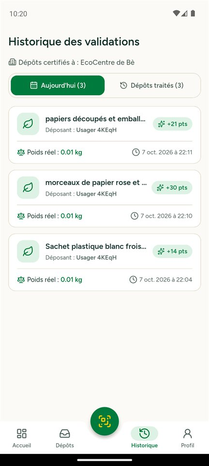
</p>

## Tests

```bash
flutter test
```

## Autres docs

- [Guide pour commencer](ONBOARDING.md) : nos conventions, le design
  system et les widgets qu'on a faits
- [Architecture](docs/architecture.md) : comment le projet est découpé
- [Base Firestore](docs/firestore.md)
- [Comment on utilise Git](CONTRIBUTING.md)

## Ce qu'on a utilisé

Flutter, Riverpod (avec génération de code), GoRouter, Firebase
(Auth, Firestore), flutter_map (OpenStreetMap), dartz.
